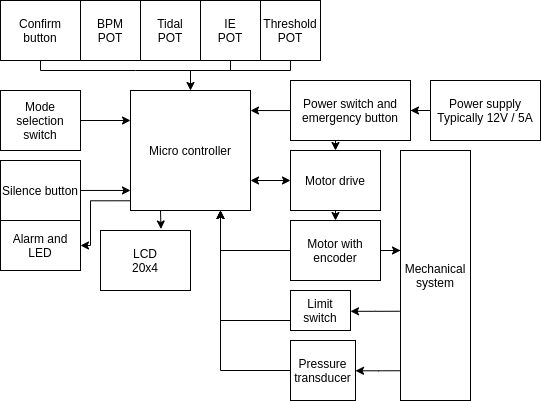
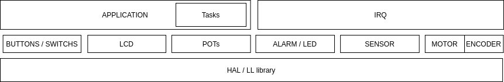
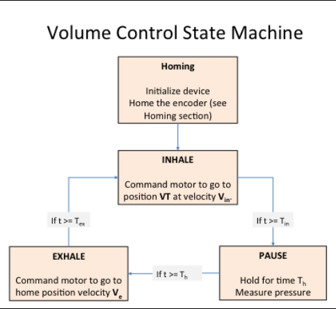
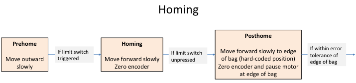

# Emergency Ventilator
The firmware project of the emergengy ventilator. This project is based on the MIT Emergengy Ventilator project.

## Table of contents
- [Emergency Ventilator](#emergency-ventilator)
  - [Table of contents](#table-of-contents)
  - [Electrical architecture](#electrical-architecture)
  - [Firmware stack](#firmware-stack)
  - [References](#references)

## Electrical architecture

- Micro controller: Currently we using **STM32F103RTC6** as our main processing controller, include motor controlling.
- Power supply: 12V power source. Typically 5A to power all the system, including motor, microcontroller and other peripherals.
- LCD 20x4. The first line display the message when in operation. The remaining lines show the adjustable values such as tidal volume, respiratory rate, I:E ratio (on the left) and pressure values (on the right).
- Potentionmeters: 10kOhm, to adjust parameters for operation.
- Motor drive
- Pressure transducer

## Firmware stack

The stack can be divided into 3 layers: low layer, mid layer and application layer.
- Low layer: basically is HAL/LL library. This layer is generated by tools such as CubeMX, or pre-loaded into the system. This layer heavily depends on hardware.
- Mid layer: stay on top of Low layer. A set of module / libraries that grouped by features or hardware module. This layer partially depends on hardware. In other word, this layer separates hardware dependent code with application layer.
- Application layer: System logic. This layer has 2 parts as shown in the image: application and interrupt service routine (IRQ).
    + IRQ: Handle system's interrupt service routine.
    + Application: application logic implementation. This part should have minimum dependent with the hardware and only communication with hardware via Mid layer. The system operate in several states.

[https://e-vent.mit.edu/controls/high-level-controls/]

Application runs in task-based fashion. There are 2 types of task: regular tasks and controlling task.
Regular task are listed below:
- Task Display (LCD): Display parameter and messages.
- Task POTs: read potention meter values and convert to appropriate unit.
- Task sensor: read sensors value and convert to appropriate unit.
- Task alarm: handle the alarm sound.
- Task error: check the system errors.

Controlling task: A special task that handle the high speed task, i.e. motor controlling.

## Developer guide
[Link](./develop.md)

## References
[1] https://e-vent.mit.edu/
