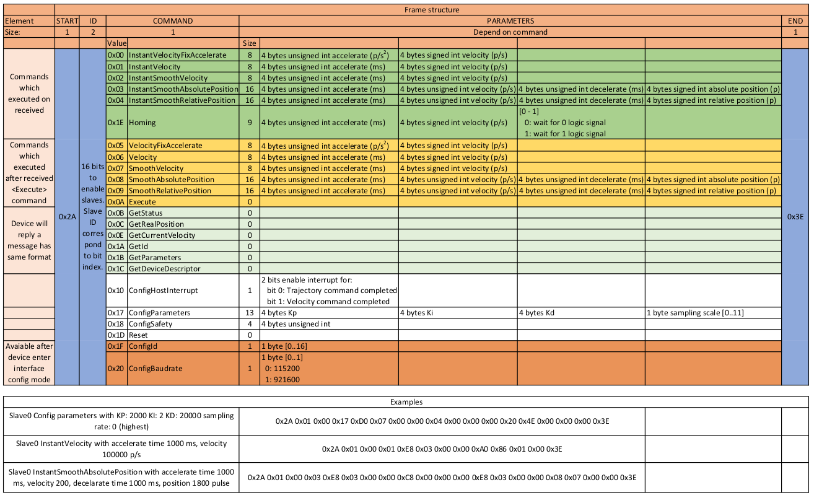

## Build project

First we need to generate base code from MX Cube config file.
The config file is in the root folder of the project.

Current configuration on the repository using Makefile to bulid the project with arm-gcc-none-eabi and flashing using st-flash command.

If you want to use other tool, please changes it in the MXCube configuration.

## Libraries

### Low-level library
This project using HAL driver from ST as the interface to communicate with hardware.
These driver files are generated and imported directly into the project with MXCube.
The peripheral used in this project include:
- GPIO: control the LCD,send alarm signal with led and buzzer, read switches
- UART: communicate with external motor controller
- 12-bit ADC with DMA: Read analog signal from pressure sensor and POTs

### Mid-level library
A set of module / libraries that grouped by features or hardware module. This level isolates the application logic with hardware.
List of module defined in this layer include:
- POTs: Read and convert values from all pots and store it for later processing. Refer to the [code documentation](Core/Src/pots.c#L21) for the conversion formula.
- Hash: Implement a simple hashing algorithm for manage 1-D data
- LCD: define communication commands with LCD. This library interact with LCD using 4-pin configuration and pure GPIO actions and is write-only. For the messages and status that display on LCD, we again use another hash table to manage it.
- Alarm: Define functions that deal with the alarm states and its sound/light pattern. This library depends on hash to manage the error tone list.
- Button: Store the buttons event to run the application logic synchronously.

To adjust all the constants or parameters in the system, please goes to to [constant.h](Core/Inc/constants.h) and [constant.c](Core/Src/constants.c)

### Application

#### Task: Or task manager
Define functions to manage to flow and state of multiple task in the system. The tasks are running synchronously.

For running multiple tasks, the task manager use systick with period 1ms to call the task functions.

The task list declaration stay inside the [tasks.h](Core/Inc/task.h#L57) file.
Each task functionality and it meaning are documented in the source code.
All the task definitions are stay inside the [task](Core/Src/task) folder.

#### State
Basically, there are 4 main states in the system: Homing, Inhale, Inhale pause and exhale.

**Sub-states of Homing**:
- Prehome: at startup, 2 fingers move out until it reach the homing switch.
- Homing: 2 finger moving inward to the fixed zero position.
- Posthome: Stay at zero position and ready for inhale state.

**Inhale**: fingers move inward to position with speed calculated from POTs values. The calculation process follow [Calculating Waveform Timing & Durations]([https://link](https://e-vent.mit.edu/controls/high-level-controls/)) section in reference project page

**Inhale pause**: After the reach the desire position, pause the finger a little while to measure the plateau pressure.

**Exhale**: figners move outward to zero position.

Reference project: [MIT E-vent state machine]([https://link](https://e-vent.mit.edu/controls/high-level-controls/))

#### Motor control
In this version, the system control the motor using an external controller (slave). The communciation is done throught the UART line with the default setting is *(baudrate, databit, stopbit, parity) = (115200, 8, 1, None)*. The command frames are shown as below:

In the command list above, the instant comands, which marked green will execute imediately after the controller have received the command. The ones marked yellow only execute after the `Execute` command is sent to the controller.

**Note**: for simplicity, we use boardcast ID *(0xFF)* to communicate with the controller regardless the actual ID that the slave is holding.

The PID parameters are pre-tuned with current version (v1) and embedded to the controller by default. If other motor or other mechanical system are used, please tunes it again in order to make it works.

#### Others
The assist control mode is not supported in this project yet, which result in the Switch mode pin being not used by the system currently.

Due to hardware limitation, the pressure sensor ADC values do not have much meaning to the system. So all kind of pressure values are not recorded yet.

TIM4 is added to the system to perform micro-second delay. The delay function is in the [support.c file](Core/Src/support.c).

** For detail explanation of the functions using in the program, please refer directly to the source code. The code documentation follow **doxygen** syntax.
